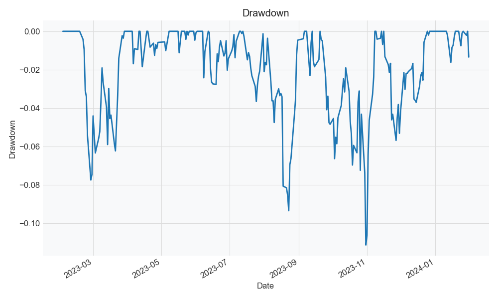

# Plutus Project Template

## Abstract
Vietnamese open-end funds recently have seen significant growth in the number of people investing in them, especially after the introduction of [Fmarket](https://fmarket.vn). 
Their performances are very persuasive, with many funds having a return of 20-30% per year. 
In this project, I use the VCBF open-end fund's financial portfolio to select stocks. I believe that the fund's financial portfolio can be used as a good indicator for stock selection. 
Each month, a list of 3 highest scored stocks will be selected based on the fund's financial portfolio and the stocks' financial ratios. 
The stocks will be held for 1 month and then rebalanced. 
The performance of the strategy will be compared with the benchmark index (VN-Index) to evaluate its effectiveness. 
The results show that the strategy outperforms the benchmark index with a return of 28.45% annually and a maximum drawdown of -11.57% in the out-of-sample period.

## Introduction
- Briefly introduce the project.
- Problem statement, research question or the hypothesis.
- Method(s) to solve the problem
- What are the results?


After optimization, the method yields 39.31% annually return, -8.35% maximum drawdown, and 1.97 Sharpe ratio in the in-sample period.
For the out-of-sample period, the method yields 28.45% annual return, -8.35% maximum drawdown, and 1.97 Sharpe ratio.

## Trading (Algorithm) Hypotheses
In addition to smart-beta strategy that use quantitative factors to select stocks, I also use the VCBF open-end fund's financial portfolio to select stocks. I believe that the fund's financial portfolio can be used as a good indicator for stock selection.

## Data
- Data source: Algotrade internship database, [VCBF](https://vcbf.com.vn/), [VCI using Vnstock library](https://github.com/thinh-vu/vnstock)
- Data type
- Data period: from 2022-01-01 to 2025-01-31
- Both input and output data will be stored in a specified data path. The default data path is `data` folder in the root directory of the project. You can change the data path by changing the `DATA_PATH` variable in the `.env` file.
- Data format: mainly CSV files, JSON files are used to store evaluation results and hyperparameters.
 
### Data collection
#### VCBF open-end fund financial portfolio
- The VCBF open-end fund's financial portfolio is collected from [VCBF](https://vcbf.com.vn/) website using web scraping. I download excel files from crawled links and extract necessary data to CSV files.
- The data is collected using the `src.crawler.vcbf_crawler` module. The files are stored in `<DATA_PATH>/VCBF/downloaded/`.
- Due to VCBF only started publishing report in excel format since late 2022, I only collect data from 2022-11-01 to 2025-01-31. 
- The retrieved list of stocks are used to select stocks, which means other stocks that are not in the list will be ignored in the strategy.

#### Daily price, quantity of Vietnamese stocks
- The daily price and quantity of Vietnamese stocks are collected from Algotrade internship database using SQL queries. 
- The data is collected using the `src.crawler.stocks_crawler` module. 
- The data is stored in the `<DATA_PATH>/daily_data.csv` file. 
- By default, the data is collected from 2022-01-01 to 2025-01-31. You can change the time range by changing the `start_date` and `end_date` parameters of `data_collection` in the `config/config.yaml` file.

#### Stocks financial portfolio data
- Financial information of the stocks is collected using Vnstock library, which use VCI data source to return financial information of the stocks.
- The data is collected using the `src.crawler.stocks_crawler` module.
- The data is stored in the `<DATA_PATH>/financial_data.csv` file.
- The time range is the same as the daily price and quantity of Vietnamese stocks.

### Data Processing
#### Extract VCBF open-end fund financial portfolio
- The downloaded excel files are extracted to CSV files. The results are stored in `<DATA_PATH>/VCBF/extracted/` folder.
- These CSV files are then merged into a single CSV file and stored in `<DATA_PATH>/VCBF/fund_portfolios.csv` file.

#### Monthly scores preprocessing
- To speed up backtest process, I preprocess the financial scores and institutional scores into a single CSV file named `<DATA_PATH>/monthly_scores.csv` file.
- The preprocessing process is done using the `src.preprocess` module.
- Details of the scores calculation are described in the Backtesting section below.

## Implementation
- Briefly describe the implemetation.
    - How to set up the enviroment to run the source code and required steps to replicate the results
    - Discuss the concrete implementation if there are any essential details
    - How to run each step from `In-sample Backtesting`, Step 4 to `Out-of-sample Backtesting`, Step 6 (or `Paper Trading`, Step 7).
    - How to change the algorithm configurations for different run.
- Most important section and need the most details to correctly replicate the results.
### Environment Setup
1. Set up python virtual environment
```bash
python3 -m venv venv
source venv/bin/activate # for Linux/MacOS
.\venv\Scripts\activate.bat # for Windows command line
.\venv\Scripts\Activate.ps1 # for Windows PowerShell
```
2. Install the required packages
```bash
pip install -r requirements.txt
```
3. Create `.env` file in the root directory of the project and fill in the required information. The `.env` file is used to store environment variables that are used in the project. The following is an example of a `.env` file:
```env
DB_NAME=<database name>
DB_USER=<database user name>
DB_PASSWORD=<database password>
DB_HOST=<host name or IP address>
DB_PORT=<database port>
DATA_PATH=<path to the data folder of your choice, if not specified, the default is `data`>
```
The `DATA_PATH` variable is used to specify the path to the data folder where the input data is stored. The other variables are used to connect to the database.

### Data Collection
1. Retrieve VCBF open-end fund financial portfolio 
In the root directory of the project, run the following command. The process will take about 7-10 minutes to finish.
```bash
python -m src.crawler.vcbf_crawler
```
The result will be stored in the `<DATA_PATH>/VCBF/fund_portfolios.csv` file with other downloaded files from VCBF's website. The data is stored with the following format:
```csv
Fund Code,Date,Category,Quantity,Market Price,Value,Total Asset Ratio
VCBF-BCF,2023-01-01,ACB,504488.0,26050.0,13141912400.0,0.0352110336932618
...
```
2. Retrieve daily price, quantity and financial data of Vietnamese stocks
If you have access to Algotrade internship database, you can use the following command to retrieve the data. 

```bash
python -m src.stocks_crawler 
```

The data time range is configured in the `config/config.yaml` file. The default time range is from 2022-01-01 to 2025-01-31. You can adjust the time range by changing the `start_date` and `end_date` parameters of `data_collection` in the `config/config.yaml` file.

The daily stock price results will be stored in the `<DATA_PATH>/daily_data.csv` file. The data is stored with the following format:
```csv
datetime,tickersymbol,price,quantity
2024-12-31,VIC,40.55,1784400
...
```

Stocks financial portfolio data will be stored in the `<DATA_PATH>/financial_data.csv` file. The data is stored with the following format:
```csv
Revenue,year,quarter,Cash,Liabilities,P/E,ROE,Financial Leverage,Debt/Equity,tickersymbol
9053845000000,2022,1,6281931000000,480433095000000,7.7889284027,0.236563115,10.966802399327864,9.9668023993,ACB
...
```

### Data processing
Now we preprocess the financial data and institutional data to prepare for backtesting step.
```bash
python -m src.preprocess
```
The result will be stored in the `<DATA_PATH>/monthly_scores.csv` file. The data is stored with the following format:
```csv
symbol,fund_net_buying,number_fund_holdings,net_fund_change,roe,debt_to_equity,revenue_growth,pe,month,year
ACB,0.18949771689497716,3.0,3.0,0.2649167736,9.401935188,15.362221323862574,6.1561819167,2,2023
...
```

### In-sample Backtesting
- To init parameters for the first run, access `config/config.yaml` file and adjust the `default_backtest_params`.
- For this project, we use data of the period from 2023-02-01 to 2024-01-31 as the in-sample period. These can be adjusted in `config/config.yaml`.
- `--name` argument must match the configuration name in `config/config.yaml` file, where each name has `start_date` and `end_date` parameters. The default name is `in_sample`. This name will also be used to save in the result folder.
```bash
python -m src.backtest --name in_sample
```
The result will be stored in the `<DATA_PATH>/backtest/in_sample` folder.

### Optimization
Run this command to start the optimization process. You can adjust the random seed by editing `random_seed` in the `config/config.yaml` file. The default random seed is 42.
```bash
python -m src.optimize --n_trials 5000 
```
The optimization result will be stored in the `<DATA_PATH>/optimization` folder. And the optimized in-sample backtest result will be stored in the `<DATA_PATH>/backtest/optimized_in_sample` folder.
This process will take about 1-2 hours to finish on a standard laptop.

### Out-of-sample Backtesting
Run this command to start the out-of-sample backtesting process.
```bash
python -m src.backtest --name out_sample
```
The result will be stored in the `<DATA_PATH>/backtest/out_sample` folder.

### Configurations
- The configuration file is stored in the `config/config.yaml` file. You can adjust the parameters in this file to change the behavior of the algorithm.
- Read the `config/README.md` file for more details about the configuration file.

## In-sample Backtesting
### Stock Selection
- Score of stock is calculated by the following formula:
$$
\text{score} = x_1 \cdot \text{institutional_score} + x_2 \cdot \text{financial_score}
$$
Where:
- $x_1$ and $x_2$ are the weights of the institutional score and financial score respectively. The default values are 0.5 for both scores.
- The institutional score is calculated by the following formula:
$$
\text{institutional_score} = \frac{\text{fund_net_buying}}{\text{number_fund_holdings}} + \frac{\text{net_fund_change}}{\text{number_fund_holdings}}
$$
Where:
- $\text{fund_net_buying}$ is the net buying of the fund in the month.
- $\text{number_fund_holdings}$ is the number of funds holding the stock.
- $\text{net_fund_change}$ is the net change of the fund in the month.
- The financial score is calculated by the following formula:
$$
\text{financial_score} = \frac{\text{roe}}{\text{debt_to_equity}} + \frac{\text{revenue_growth}}{\text{pe}}
$$
Where:
- $\text{roe}$ is the return on equity.
- $\text{debt_to_equity}$ is the debt to equity ratio.
- $\text{revenue_growth}$ is the revenue growth rate.
- $\text{pe}$ is the price to earnings ratio.

### Rebalancing

### Evaluation Metrics
- Backtesting results are stored in the `<DATA_PATH>/backtest/` folder. 
- Used metrics to compare with VNINDEX are: 
  - Compound annual growth rate (CAGR)
  - Maximum drawdown (MDD)
  - Sharpe ratio (SR)
  - Sortino ratio (SoR)
  - Calmar ratio (CR)
  - Votality (Vol)
  - Max Time to Recover from a drawdown (MTR) in days

### In-sample Backtesting Result
- Table of the backtesting results, compare with VNINDEX benchmark from 2023-02-01 to 2024-01-31.
  
| | CAGR | MDD | SR | SoR | CR | Vol | MTR |
|---|---|---|---|---|---|---|---|
| In-sample | 12.97% | -12.13% | 0.47 | 0.62 | 1.07 | 19.03% | 224 |
| VNINDEX | 8.24% | -17.44% | 0.26 | 0.31 | 0.47 | 16.03% | 223 |

- Cummulative return plot of initial backtesting results, along with VNINDEX benchmark.

- Maximum drawdown 

- Daily return 

- Cash flow


## Optimization
- Describe the Optimization step
    - Optimization process/methods/library
    - Parameters to optimize
    - Hyper-parameter of the optimize process
- Step 5 of the Nine-Step

### Optimization Result
- Table of the optimized backtesting results, compare with VNINDEX benchmark from 2023-02-01 to 2024-01-31.
  
| | CAGR | MDD | SR | SoR | CR | Vol | MTR |
|---|---|---|---|---|---|---|---|
| Optimized In-sample | 39.31% | -8.36% | 1.97 | 3.15 | 4.70 | 14.68% | 203 |
| VNINDEX | 8.24% | -17.44% | 0.26 | 0.31 | 0.47 | 16.03% | 223 |

- Cummulative return plot of initial backtesting results, along with VNINDEX benchmark.

- Maximum drawdown

- Daily return

- Cash flow


## Out-of-sample Backtesting
- Describe the Out-of-sample Backtesting step
    - Parameter
    - Data
- Step 6 of th Nine-Step

### Out-of-sample Backtesting Result
- Table of the backtesting results, compare with VNINDEX benchmark from 2024-02-01 to 2025-01-31.

| | CAGR | MDD | SR | SoR | CR | Vol | MTR |
|---|---|---|---|---|---|---|---|
| Out-of-sample | 28.94% | -11.57% | 1.37 | 2.01 | 2.50 | 16.68% | 208 |
| VNINDEX | 8.01% | -8.94% | 0.27 | 0.34 | 0.90 | 13.70% | 223 |

- Cummulative return plot of initial backtesting results, along with VNINDEX benchmark.

- Maximum drawdown

- Daily return

- Cash flow


## Paper Trading
- Not yet implemented

## Conclusion
- What is the conclusion?
- Optional

## Reference


