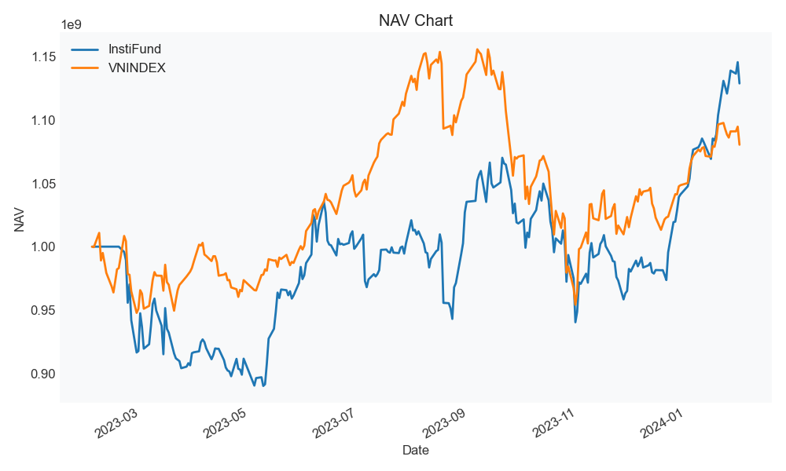
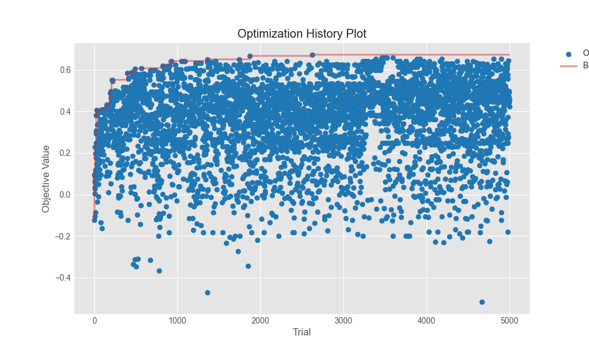
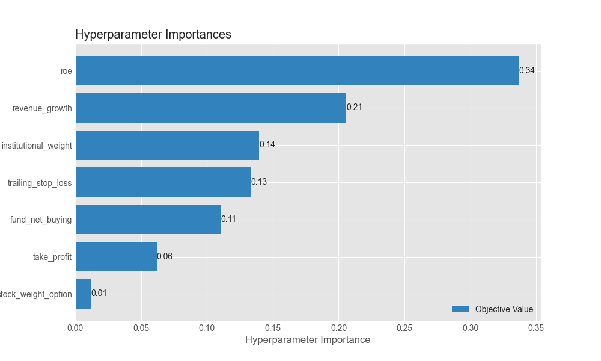
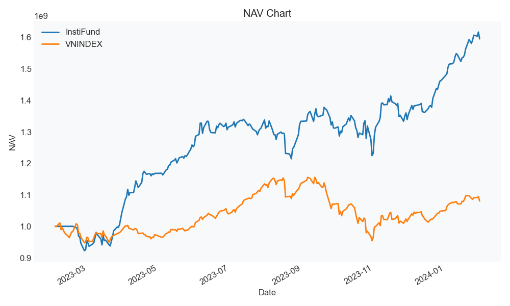
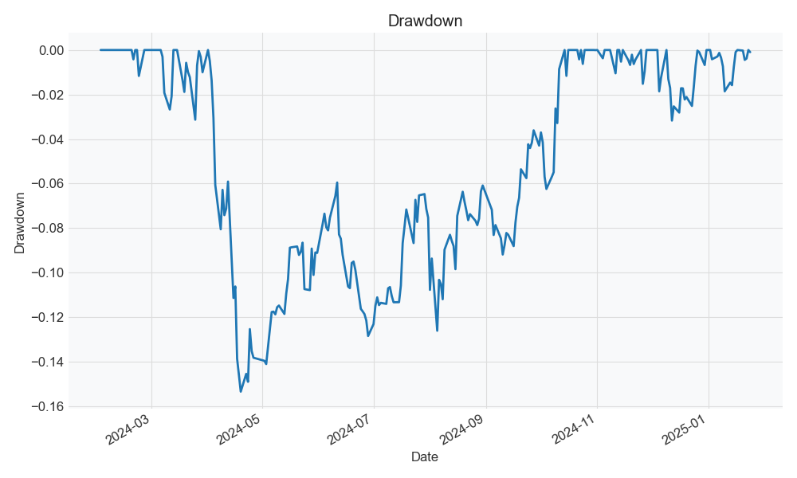
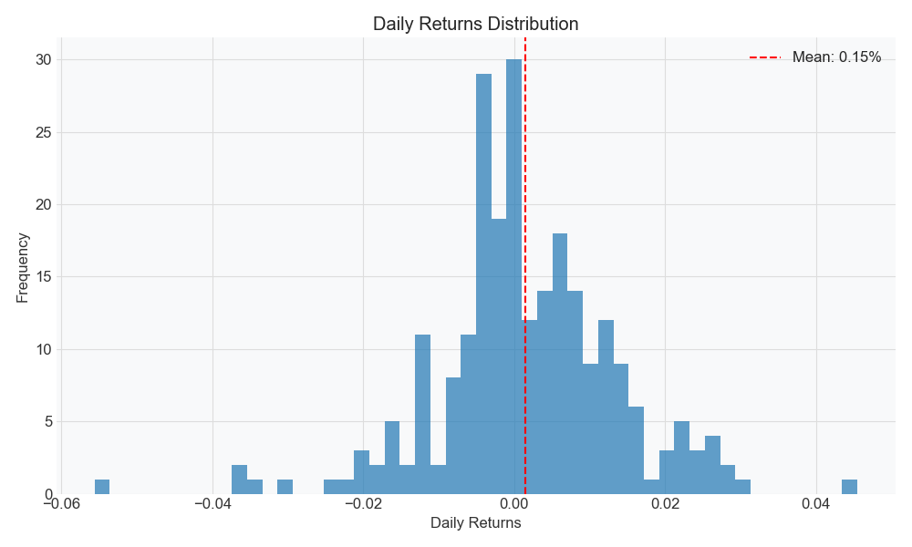
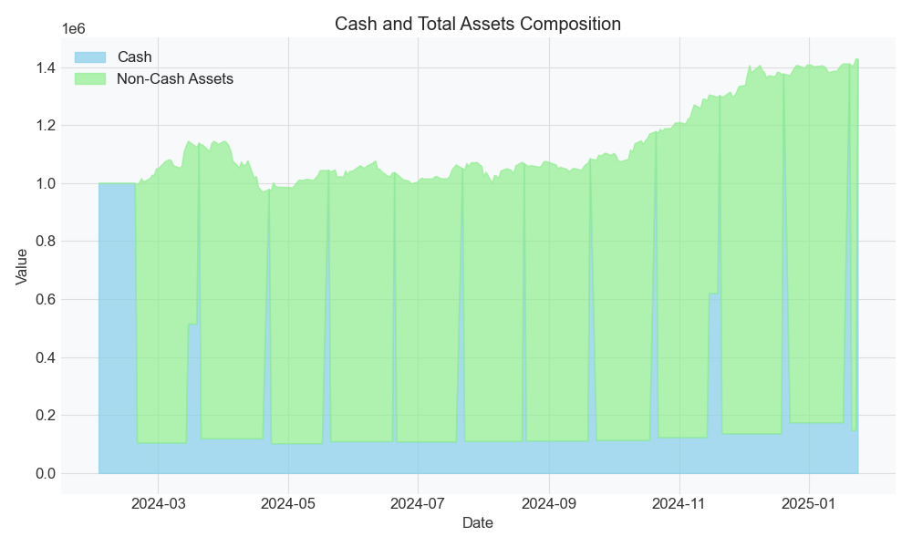

# InstiFund
> Select stocks based on Institutional Investment Trends and Fundamental Analysis

## Abstract
Vietnamese open-end funds recently have seen significant growth in the number of people investing in them, especially after the introduction of [Fmarket](https://fmarket.vn). 
Their performances are very persuasive, with many funds having a return of 20-30% per year. 
In this project, I use the VCBF open-end fund's financial portfolio to select stocks. I believe that the fund's financial portfolio can be used as a good indicator for stock selection. 
Each month, a list of 3 highest scored stocks will be selected based on the fund's financial portfolio and the stocks' financial ratios. 
The stocks will be held for 1 month and then rebalanced. 
The performance of the strategy will be compared with the benchmark index (VN-Index) to evaluate its effectiveness. 
The results show that the strategy outperforms the benchmark index with a ROI of 42.87% and a maximum drawdown of -15.35% in the out-of-sample period.

## Introduction
Vietnamese open-end funds have recently gained popularity among investors, particularly following the launch of Fmarket. Many funds report annual returns of 20-30%, making them attractive investment vehicles. However, retail investors often face challenges in selecting individual stocks due to the complexity of financial analysis and market dynamics.

This project aims to address this challenge by leveraging the VCBF open-end fund's financial portfolio as a key indicator for stock selection. The hypothesis is that stocks held by the fund represent high-quality investments, and by systematically selecting the best-performing stocks based on financial ratios, it is possible to generate superior returns compared to the market benchmark (VN-Index).

The methodology involves a monthly selection of the top three stocks with the highest scores, determined through a combination of institutional and financial metrics. These stocks are held for one month before rebalancing. The strategy is backtested using historical data, and an optimization process is conducted using Optuna to fine-tune parameters for maximum performance.

Results indicate that the strategy achieves an optimized annual return of 59.52% with a maximum drawdown of -11.14% and a Sharpe ratio of 2.08 during the in-sample period. For the out-of-sample period, the method maintains strong performance with a 42.87% annual return, -15.35% maximum drawdown, and a Sharpe ratio of 1.74, consistently outperforming the VN-Index.

These findings suggest that incorporating institutional investment trends into a systematic trading strategy can be a viable approach for retail investors seeking to enhance portfolio returns.

## Trading (Algorithm) Hypotheses
In addition to smart-beta strategy that use quantitative factors to select stocks, I also use the VCBF open-end fund's financial portfolio to select stocks. I believe that the fund's financial portfolio can be used as a good indicator for stock selection.

## Data
- Data source: Algotrade internship database, [VCBF](https://vcbf.com.vn/), [VCI using Vnstock library](https://github.com/thinh-vu/vnstock)
- Data type
- Data period: from 2022-01-01 to 2025-01-31
- Both input and output data will be stored in a specified data path. The default data path is `data` folder in the root directory of the project. You can change the data path by changing the `DATA_PATH` variable in the `.env` file.
- Data format: mainly CSV files, JSON files are used to store evaluation results and hyperparameters.
 
### Data collection
#### VCBF open-end fund financial portfolio
- The VCBF open-end fund's financial portfolio is collected from [VCBF](https://vcbf.com.vn/) website using web scraping. I download excel files from crawled links and extract necessary data to CSV files.
- The data is collected using the `src.crawler.vcbf_crawler` module. The files are stored in `<DATA_PATH>/VCBF/downloaded/`.
- Due to VCBF only started publishing report in excel format since late 2022, I only collect data from 2022-11-01 to 2025-01-31. 
- The retrieved list of stocks are used to select stocks, which means other stocks that are not in the list will be ignored in the strategy.

#### Daily price, quantity of Vietnamese stocks
- The daily price and quantity of Vietnamese stocks are collected from Algotrade internship database using SQL queries. 
- The data is collected using the `src.crawler.stocks_crawler` module. 
- The data is stored in the `<DATA_PATH>/daily_data.csv` file. 
- By default, the data is collected from 2022-01-01 to 2025-01-31. You can change the time range by changing the `start_date` and `end_date` parameters of `data_collection` in the `config/config.yaml` file.

#### Stocks financial portfolio data
- Financial information of the stocks is collected using Vnstock library, which use VCI data source to return financial information of the stocks.
- The data is collected using the `src.crawler.stocks_crawler` module.
- The data is stored in the `<DATA_PATH>/financial_data.csv` file.
- The time range is the same as the daily price and quantity of Vietnamese stocks.

### Data Processing
#### Extract VCBF open-end fund financial portfolio
- The downloaded excel files are extracted to CSV files. The results are stored in `<DATA_PATH>/VCBF/extracted/` folder.
- These CSV files are then merged into a single CSV file and stored in `<DATA_PATH>/VCBF/fund_portfolios.csv` file.

#### Monthly scores preprocessing
- To speed up backtest process, I preprocess the financial scores and institutional scores into a single CSV file named `<DATA_PATH>/monthly_scores.csv` file.
- The preprocessing process is done using the `src.preprocess` module.
- Details of the scores calculation are described in the Backtesting section below.

## Implementation
### Environment Setup
1. Set up python virtual environment
```bash
python -m venv venv
source venv/bin/activate # for Linux/MacOS
.\venv\Scripts\activate.bat # for Windows command line
.\venv\Scripts\Activate.ps1 # for Windows PowerShell
```
2. Install the required packages
```bash
pip install -r requirements.txt
```
3. (OPTIONAL) Create `.env` file in the root directory of the project and fill in the required information. The `.env` file is used to store environment variables that are used in the project. The following is an example of a `.env` file:
```env
DB_NAME=<database name>
DB_USER=<database user name>
DB_PASSWORD=<database password>
DB_HOST=<host name or IP address>
DB_PORT=<database port>
DATA_PATH=<path to the data folder of your choice, if not specified, the default is `data`>
```
The `DATA_PATH` variable is used to specify the path to the data folder where the input data is stored. The other variables are used to connect to the database.

**Note:** Skip this step if you decide to use the provided data files on Google Drive (option 1).

### Data Collection
#### Option 1. Download from Google Drive
You can skip this step by download the necessary data files from [Google Drive](https://drive.google.com/drive/folders/1kdCQ7sQJIKiBMWDF37x5PflQ2gAejmDs?usp=sharing) and put them in the `data` folder.
- The data files are stored in the `data` folder. The folder structure is as follows:
```
data 
├── VCBF
│   └── fund_portfolios.csv
├── financial_data.csv
├── daily_data.csv
```
#### Option 2. Run codes to collect data
1. Retrieve VCBF open-end fund financial portfolio 
In the root directory of the project, run the following command. The process will take about 7-10 minutes to finish.
```bash
python -m src.crawler.vcbf_crawler
```
The result will be stored in the `<DATA_PATH>/VCBF/fund_portfolios.csv` file with other downloaded files from VCBF's website. The data is stored with the following format:
```csv
Fund Code,Date,Category,Quantity,Market Price,Value,Total Asset Ratio
VCBF-BCF,2023-01-01,ACB,504488.0,26050.0,13141912400.0,0.0352110336932618
...
```
2. Retrieve daily price, quantity and financial data of Vietnamese stocks
If you have access to Algotrade internship database, you can use the following command to retrieve the data. 

```bash
python -m src.stocks_crawler 
```

The data time range is configured in the `config/config.yaml` file. The default time range is from 2022-01-01 to 2025-01-31. You can adjust the time range by changing the `start_date` and `end_date` parameters of `data_collection` in the `config/config.yaml` file.

The daily stock price results will be stored in the `<DATA_PATH>/daily_data.csv` file. The data is stored with the following format:
```csv
datetime,tickersymbol,price,quantity
2024-12-31,VIC,40.55,1784400
...
```

Stocks financial portfolio data will be stored in the `<DATA_PATH>/financial_data.csv` file. The data is stored with the following format:
```csv
Revenue,year,quarter,Cash,Liabilities,P/E,ROE,Financial Leverage,Debt/Equity,tickersymbol
9053845000000,2022,1,6281931000000,480433095000000,7.7889284027,0.236563115,10.966802399327864,9.9668023993,ACB
...
```

### Data processing
Now we preprocess the financial data and institutional data to prepare for backtesting step.
```bash
python -m src.preprocess
```
The result will be stored in the `<DATA_PATH>/monthly_scores.csv` file. The data is stored with the following format:
```csv
symbol,fund_net_buying,number_fund_holdings,net_fund_change,roe,debt_to_equity,revenue_growth,pe,month,year
ACB,0.18949771689497716,3.0,3.0,0.2649167736,9.401935188,15.362221323862574,6.1561819167,2,2023
...
```

### In-sample Backtesting
- To init parameters for the first run, access `config/config.yaml` file and adjust the `default_backtest_params`.
- For this project, we use data of the period from 2023-02-01 to 2024-01-31 as the in-sample period. These can be adjusted in `config/config.yaml`.
- `--name` argument must match the configuration name in `config/config.yaml` file, where each name has `start_date` and `end_date` parameters. The default name is `in_sample`. This name will also be used to save in the result folder.
```bash
python -m src.backtest --name in_sample
```
The result will be stored in the `<DATA_PATH>/backtest/in_sample` folder.

### Optimization
Run this command to start the optimization process. You can adjust the random seed by editing `random_seed` in the `config/config.yaml` file. The default random seed is 42.
```bash
python -m src.optimize --n_trials 5000 
```
The optimization result will be stored in the `<DATA_PATH>/optimization` folder. And the optimized in-sample backtest result will be stored in the `<DATA_PATH>/backtest/optimized_in_sample` folder.
This process will take about 1-2 hours to finish on a standard laptop. You can skip this step by copying the [best_params.json](doc/report/optimization/best_params.json) file to the `<DATA_PATH>/optimization` folder.

After that, you can run the in-sample backtesting process again with the optimized parameters. 
```bash
python -m src.backtest --name optimized_in_sample
```
The result will be stored in the `<DATA_PATH>/backtest/optimized_in_sample` folder.

### Out-of-sample Backtesting
Run this command to start the out-of-sample backtesting process.
```bash
python -m src.backtest --name out_sample
```
The result will be stored in the `<DATA_PATH>/backtest/out_sample` folder.

### Configurations
- The configuration file is stored in the `config/config.yaml` file. You can adjust the parameters in this file to change the behavior of the algorithm.
- Read the `config/README.md` file for more details about the configuration file.

## In-sample Backtesting
### Stock Selection
Score of a stock is calculated by the following formula:
```math
\text{score} = x_1 \cdot \text{institutional\_score} + x_2 \cdot \text{financial\_score}
```

The institutional score is calculated by the following formula:
```math
\text{institutional\_score} = x_3 \cdot \text{fund\_net\_buying} + x_4 \cdot \text{number\_fund\_holdings} + x_5 \cdot \text{net\_fund\_change}
```
Where:
- `fund_net_buying` is the net buying of the fund in the month.
- `number_fund_holdings` is the number of funds holding the stock.
- `net_fund_change` is the net change of the fund in the month.

The financial score is calculated by the following formula:
```math
\text{financial\_score} = x_6 \cdot \text{roe}+ x_7 \cdot \text{debt\_to\_equity} + x_8 \cdot \text{revenue\_growth} + x_9 \cdot \text{pe}
```
Where:
- `roe` is the return on equity.
- `debt_to_equity` is the debt to equity ratio.
- `revenue_growth` is the revenue growth rate.
- `pe` is the price to earnings ratio.

The weights $x_1, x_2, \dots, x_9$ are the parameters that we want to optimize.

### Rebalancing and Risk Management
- Portfolio is rebalanced every month, at 20th of the month, when the new quarterly financial report is published, and new monthly open-end fund report is published (usually on the 8th of the month).
- Rebalancing process takes 2 days.
- On the first day, we sell all stocks in the portfolio to achieve 100% cash.
- On the second day, we execute these steps:
  1. Scoring and ranking the stocks based on the mentioned formula, and select the top 3 stocks with the highest score.
  2. Depend on the scores, we distribute the amount of cash to buy each stocks. There are 3 options: `equal`, `linear`, `softmax`, this will also be optimized in the optimization step.
  3. Buy the stocks with the allocated cash amount.
- To manage the risk, we set a trailing stop loss and a take profit. These parameters are also optimized in the optimization step.

### Evaluation Metrics
- Backtesting results are stored in the `<DATA_PATH>/backtest/` folder. 
- Used metrics to compare with VNINDEX are: 
  - Return on Investment (ROI)
  - Maximum drawdown (MDD)
  - Sharpe ratio (SR)
  - Sortino ratio (SoR)
  - Calmar ratio (CR)
  - Votality (Vol)
  - Max Time to Recover from a drawdown (MTR) in days
- Other metrics:
  - Cumulative annual growth rate (CAGR)
  - Win rate: the percentage of winning trades over total trades.
### Parameters
The default parameters are stored in the `config/config.yaml` file. 
```yaml
default_backtest_params:
  institutional_weight: 0.6
  take_profit: 0.325
  trailing_stop_loss: 0.5
  fund_net_buying: 0.35
  number_fund_holdings: 0.45
  roe: 0.3
  revenue_growth: 0.1
  pe: 0.4
  stock_weight_option: "equal"
```
- `net_fund_change` is set so as to sum up to 1 with the other parameters in the institutional score.
- `debt_to_equity` is set so as to sum up to 1 with the other parameters in the financial score.

### In-sample Backtesting Result
- Table of the backtesting results, compare with VNINDEX benchmark from 2023-02-01 to 2024-01-31.
  
| | ROI | MDD | SR | SoR | CR | Vol | MTR |
|---|---|---|---|---|---|---|---|
| In-sample | 12.88% | -12.13% | 0.47 | 0.62 | 1.07 | 19.03% | 224 |
| VNINDEX | 8.24% | -17.44% | 0.26 | 0.31 | 0.47 | 16.03% | 223 |

- Other metrics:
  - CAGR: 12.97%
  - Win rate: 47.22%
- Cummulative return plot of initial backtesting results, along with VNINDEX benchmark.

- Maximum drawdown 

- Daily return 

- Cash flow


## Optimization
- Library: Optuna
- Sampler: `TPESampler`
- Number of trials: 5000
- Optimization objective: 
```math
  0.8 \cdot \text{SR\_score} + 0.2 \cdot \text{MDD\_score}
```
Where:
  - `SR_score` varies from 0 to 1 as SR varies from 0 to 3.0.
  - `MDD_score` varies from 0 to 1 as MDD varies from -20% to -5%.
  - Check out [optimize.py](src/optimize.py) for more details.

- Optimization history 

- Parameter importance plot

- Optimized parameters: can be found in [best_params.json](doc/report/optimization/best_params.json) file.
```json
{
    "trailing_stop_loss": 0.3,
    "stock_weight_option": "equal",
    "take_profit": 0.375,
    "institutional_weight": 0.47500000000000003,
    "fund_net_buying": 0.22500000000000003,
    "number_fund_holdings": 0.425,
    "roe": 0.05,
    "revenue_growth": 0.47500000000000003,
    "pe": 0.22500000000000003
}
```

### Optimization Result
- Table of the optimized backtesting results, compare with VNINDEX benchmark from 2023-02-01 to 2024-01-31.
  
| | ROI | MDD | SR | SoR | CR | Vol | MTR |
|---|---|---|---|---|---|---|---|
| Optimized In-sample | 59.52% | -11.14% | 2.08 | 2.88 | 5.39 | 21.02% | 186 |
| VNINDEX | 8.24% | -17.44% | 0.26 | 0.31 | 0.47 | 16.03% | 223 |

- Other metrics:
  - CAGR: 59.98%
  - Win rate: 61.11%
- Cummulative return plot of initial backtesting results, along with VNINDEX benchmark.

- Maximum drawdown

- Daily return

- Cash flow


## Out-of-sample Backtesting
- The out-of-sample period is from 2024-02-01 to 2025-01-31.
- The out-of-sample backtesting process is the same as the in-sample backtesting process, but we use the optimized parameters from the optimization step.

### Out-of-sample Backtesting Result
- Table of the backtesting results, compare with VNINDEX benchmark from 2024-02-01 to 2025-01-31.

| | ROI | MDD | SR | SoR | CR | Vol | MTR |
|---|---|---|---|---|---|---|---|
| Out-of-sample | 42.87% | -15.35% | 1.74 | 2.39 | 2.86 | 19.43% | 194 |
| VNINDEX | 8.01% | -8.94% | 0.27 | 0.34 | 0.90 | 13.70% | 223 |

- Other metrics:
  - CAGR: 44.05%
  - Win rate: 66.67%
- Cummulative return plot of initial backtesting results, along with VNINDEX benchmark.

- Maximum drawdown

- Daily return

- Cash flow



